# **Battleships**
## **Overview:**
This is a python led game built by Heroku and is a purely backend project in accordance with Code Institute's project goals. The game runs on Code Institute's mock terminal. The game is single player battleships game with the objective to destroy 3 randomly placed ships on a 5x5 grid board with 15 wrong attempts.

[Here is the live version of my application](https://battleships-resubmission.herokuapp.com/)

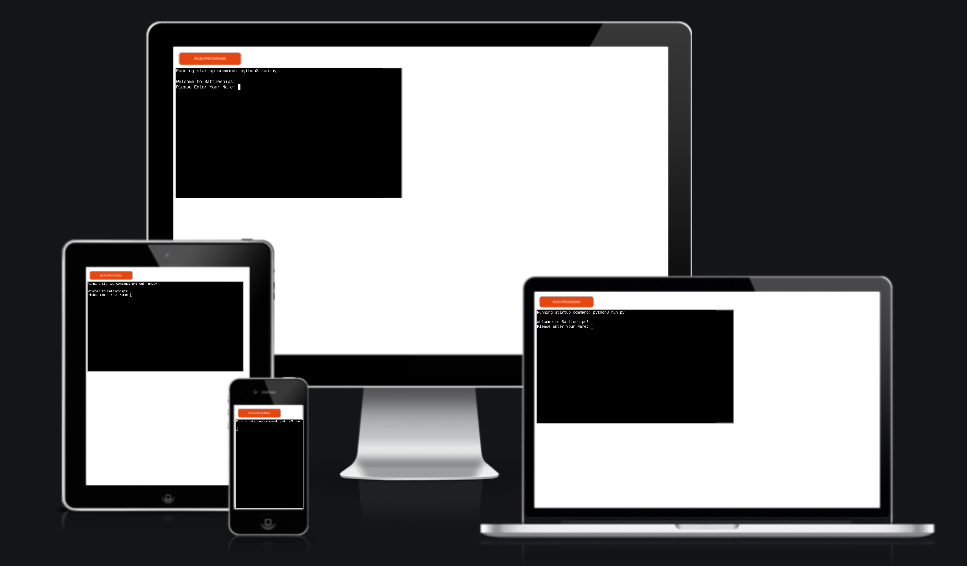

### **Aim**

##### Player-
- The player selects a row and a column within the 5x5 gaming area to eliminate three randomly placed ships. The aim is to destroy the ships before running out of missles.

##### Developer-
- The main aim for the developer is to create a bug free game which allows users to enjoy a simple game of Battleships while also providing scope to improve and add more complexity and functionality to the game in later iterations.

- The second aim is for the developer to showcase his python skills within the coding of this game. Using the BDD method of testing, the developer's aim in the first release is to create a game without bugs.

## **How to Play**

- Player will be asked there name and once given the game shall commence. Like a traditional battleships game, the player will choose a position on the gameboard to send one of there missiles. They do this by submitting a row number and a column number. The game will use this data to see if they have sunk one of the three ships on the board or if they have missed the ships. There are three ships and 15 missiles. If the player sinks all three ships, they win the game, otherwise, they will lose the game.

## **Code Modal:**
- I used an array model as I believed it was easiest to achieve my developer goals of creating a simple yet bug free game. With the array modal, I am able to iterate through indexes and manupulate what they hold in order to display the required messages back to the user. The array modal allows for absolutes in data validation as I can recieve input from a user, check the index and data it holds and respond accordingly. Arrays also allow for easy resetting of the game. A simple while loop hold all the key componants to iterate through the array until the final argument is reached. This project is entirely done with backend programming. 

- In the future I would look at making this game with a TDD approach and as a front end project. Using a framework like jest and javaScript I could see myself using classes instead of arrays. 

## **Features**

### <strong>Opening</strong>

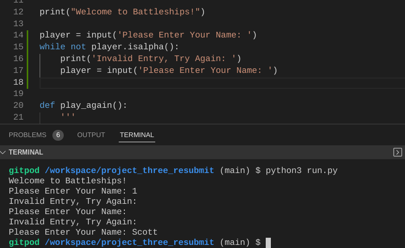
- The opening of the program requires user input to assign a user name. If the user enters anything other than letters.. isalpha().. then and error will be fired.
 

### <strong>Beginning of the Game</strong>
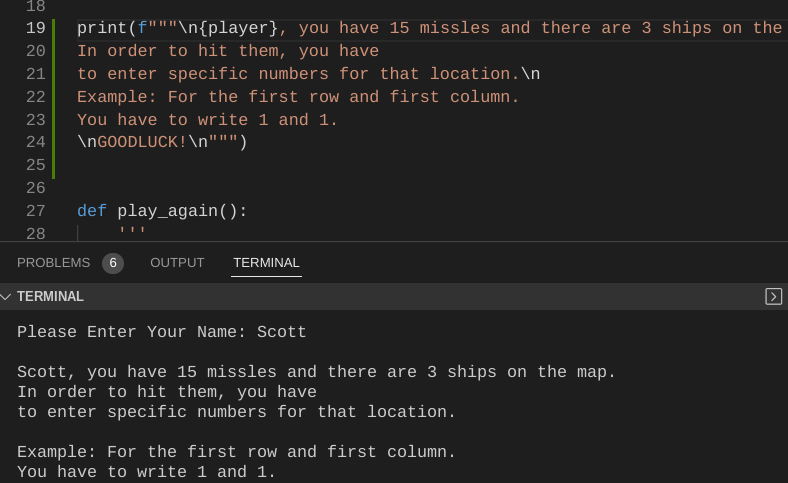
- This is the beginning of the game. Functions to build the game and allow for game play are called and operational. 

### <strong>Missed a ship</strong>
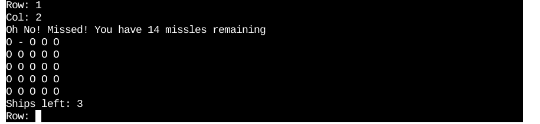
- The missles with reduce by 1 and the board updated to reflect a miss

### <strong>Hit a ship</strong>
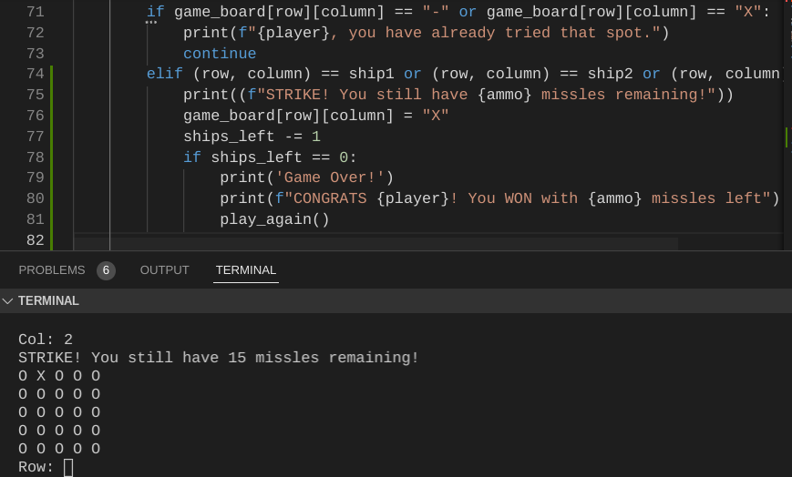
- The board will update to reflect a strike and the missles remaining stays the same

### <strong>Wrong data validation</strong>

#### Incorrect user input
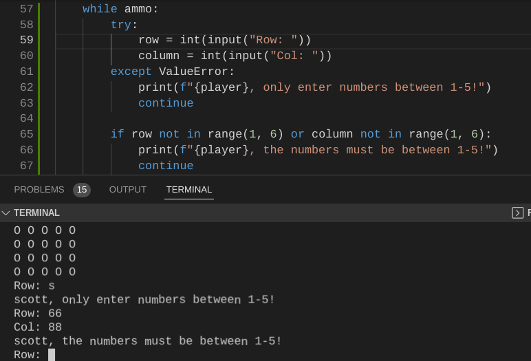
- This message occurs if the user inputs a number not within the range of the board or if the input is an unexpected type.

#### Already guessed
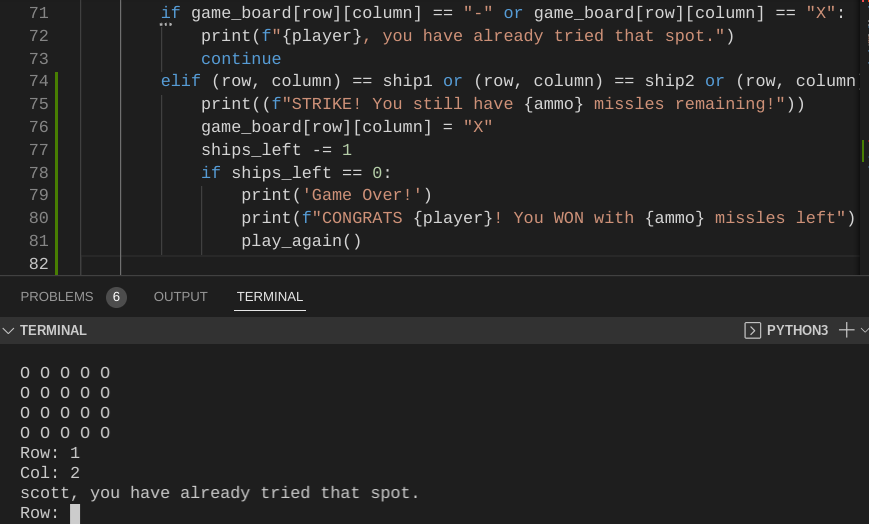
- This message occurs if the user inputs a guess they have tried already

#### Play Again?
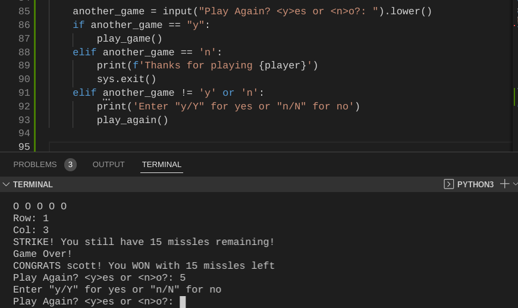
- If the user wants to play again, the can. An empty game board will appear and the game functions reset.

#### System Exit
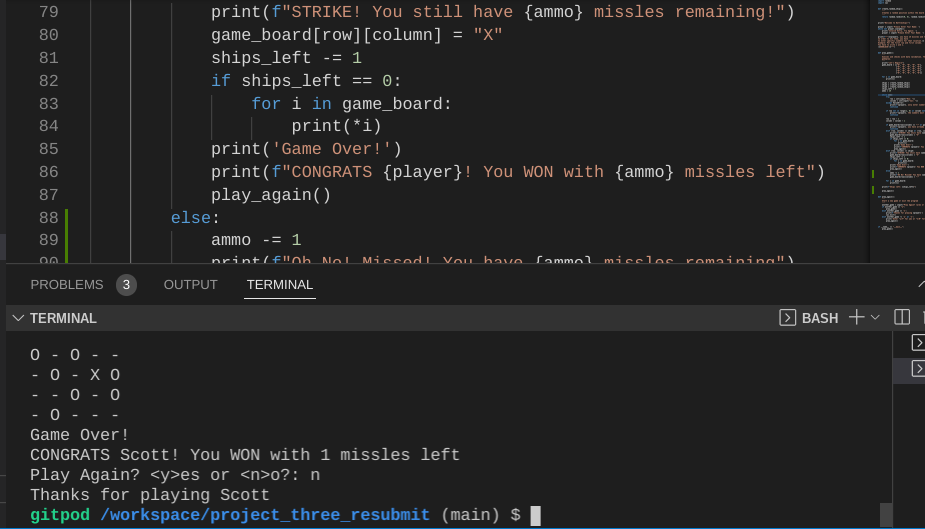
- A goodbye message appears and the program shuts down with sys.exit()

## **Future features**
 A level based system will be introduced. This will allow players to choose from Easy, Medium, Hard modes.
- Easy = 15 missles
- Medium = 10 missles
- Hard = 5 missles

## **Bugs**
- From my original submission (This is a resubmission) I didnt have the correct data validation of the user input for their name. I have addressed this with isalpha() to check that the input is the correct type.

- From my original work (This is a resubmission) I didnt validate the input when the game asked the user if they wish to play again. Any input other that 'y' was accepted as a no. With a simple if statement I have corrected this issue with user feedback.

- I found that when writting the while loop, it would change all indexes in my gameboard array to a 'strike' value. I altered my while loop to address this issue I have presented below:

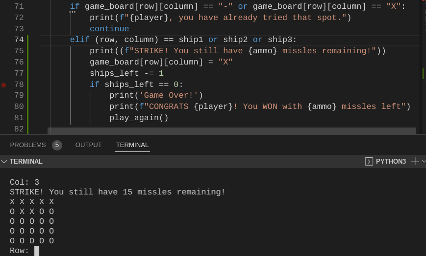

- I changed the while loop to that you see in [My Python Script](run.py)

### Current Bugs
- There are no current bugs from a users perspective in this program when I tested it using the BDD method. 

## **Testing**
- I used the Behavior Driven Development (BDD) to run tests on my program. I used GitPod's own Terminal window to continually test the program. 

- In my featured section you can see the testing I did for data validation. Here is an example of testing that was continually done throughtout development:

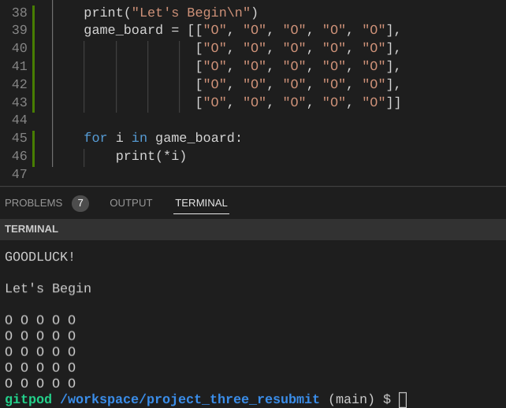

- This test was done in order to see that the gameboard was runnning properly and it was.

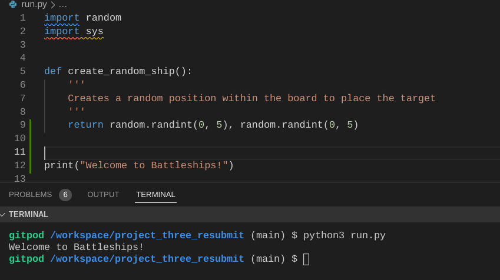

- This was to test that my welcome message was clear and running properly.

Other tests that were run throught the project can be seen in the features section. Here is a list of test I ran as a user in my game
<ol>
    <li>Test to see if i can select yes to start a new game</li>
    <li>Test to see if i can select a row and colomn above 5</li>
    <li>Test to see if i can select letters instead of numbers</li>
    <li>Test to see if i can use a number as a name</li>
    <li>Test to see if i can select the same spot on the board again</li>
</ol>

### Validation Testing

- PEP8
    - No errors returned from [PEP8 Validator](http://pep8online.com/)

## **Deployment**
- I deployed my site on Heroku. I followed instructions from [Code Institue](https://codeinstitute.net/se/5-day-coding-challenge/?utm_term=code%20institute&utm_campaign=CI+-+SWE+-+Search+-+Brand&utm_source=adwords&utm_medium=ppc&hsa_acc=8983321581&hsa_cam=14660337051&hsa_grp=134087657984&hsa_ad=546251838233&hsa_src=g&hsa_tgt=kwd-319867646331&hsa_kw=code%20institute&hsa_mt=e&hsa_net=adwords&hsa_ver=3&gclid=Cj0KCQiA15yNBhDTARIsAGnwe0UQv6qv0SwHT3sAGJ6uF8SdJR6nThPCUkVs_yMLPFdVaHSEq1RtzB8aAtAuEALw_wcB)

Site deployment guide:
<ol>
    <li>Log into Heroku Account</li>
    <li>Create new heroku app</li>
    <li>Set the buildbacks to Python and NodeJs in that order</li>
    <li>Open GitPod workspace with repository that will be used</li>
    <li>Link Heroku app to this repository
        <ol>
        <li>Type 'heroku login -i into terminal</li>
        <li>Enter your email and password details for your Heroku account</li>
        <li>Type 'heroku git:remote -a (project name in Heroku)</li>
        <li>Type 'git push heroku main' to push and build app</li>
        </ol>
    </li>
</ol>

## **Credits**
- [Code Institue](https://codeinstitute.net/se/5-day-coding-challenge/?utm_term=code%20institute&utm_campaign=CI+-+SWE+-+Search+-+Brand&utm_source=adwords&utm_medium=ppc&hsa_acc=8983321581&hsa_cam=14660337051&hsa_grp=134087657984&hsa_ad=546251838233&hsa_src=g&hsa_tgt=kwd-319867646331&hsa_kw=code%20institute&hsa_mt=e&hsa_net=adwords&hsa_ver=3&gclid=Cj0KCQiA15yNBhDTARIsAGnwe0UQv6qv0SwHT3sAGJ6uF8SdJR6nThPCUkVs_yMLPFdVaHSEq1RtzB8aAtAuEALw_wcB)

- [StackExchange](https://codereview.stackexchange.com/questions/232013/a-simple-battleship-game)

- Heroku for building and hosting my application

*Even though I didnt use any research from the internet, this stack exchange site was demanded to be credited by the Assesor. So to save the trouble I have credited it even tho I never used it

#### Libraries Used
- Random
- Sys

### **Disclaimer**

This site was built for educational purposes only. All rights to the title name, battleships idea or other remain with the copyright owners. `Battleships` is an educational project by the developer.

Developer: Scott Quinn